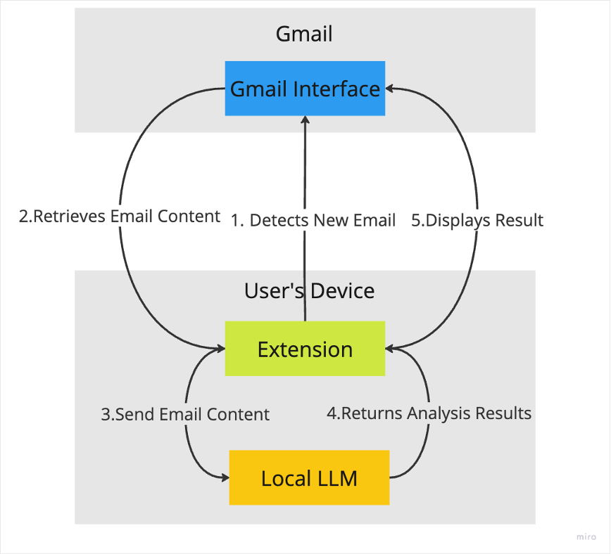

# On-Device LLM Email Security Browser Extension

This project is a browser extension designed to enhance email security by using an on-device Large Language Model (LLM) to detect phishing and scam emails. It classifies emails into legitimate, neutral, or scam/spam category, and provide detailed analysis directly within the Gmail interface.

This project is a proof-of-concept study to demonstrate the viability of on-device LLMs for detecting advanced phishing attacks that bypass traditional filters

## Nitty Gritty


1. The contentScript listens for changes in url and detect when email is loaded
2. Then contentScript extracts key elements from Gmail UI and sends to the background script.
3. Then background scripts checks if the email is already stored using chrome local storage
4. If already analysed it retrives that and send to the contentScript, if not it send to the LLM to be scanned then stores email with results & sends to the contentScript
5. Then contentScript displays with different background based on the analysis




## Setup

This extension assumes you have Ollama downloaded with gemma-2 2b model loaded and running locally. The LLM API must be available at `http://localhost:11434/api/chat`.

if not download and setup Ollama from [here](https://ollama.com)
also [read](https://medium.com/dcoderai/how-to-handle-cors-settings-in-ollama-a-comprehensive-guide-ee2a5a1beef0) this article for setting Ollama to allow requests from Chrome. - this is important

after that,
Install the extension with npm

```bash
  npm install Grounded
  cd Grounded
```

#### Load the extension into Chrome:

1. Open `chrome://extensions/`.
2. Enable Developer Mode.
3. Click Load unpacked and select the root directory of this project.
    
#### Start the Local LLM Server

run `ollama serve` on terminal

### How it works

Once the extension is loaded, it will automatically monitor - incoming Gmail messages. When an email is opened, the extension will:
- Extract the email's content, sender details, and any linked URLs.
- Send the extracted data to the on-device LLM for analysis and classification.
- Display a classification (Legitimate, Neutral, or Scam/Spam) directly in Gmail UI with an explanation of the decision.


## API Reference
The extension uses a locally hosted LLM API to perform email analysis.

#### API Endpoint

```http
  POST /api/chat
```

#### Request Body

```json {
  "model": "gemma2:2b",
  "messages": [
    {
      "role": "user",
      "content": "You are an advanced email security analysis system. Analyse..."
    }
  ]
}
```

| Parameter | Type     | Description                |
| :-------- | :------- | :------------------------- |
| `model` | `string` | **Required** The LLM model used for classification. |
| `messages` | `array` | **Required** Contains email content and metadata. |

#### Response
```json {
  {
    "model": "gemma2:2b",
    "created_at": "2024-09-12T14:24:33.101182Z",
    "message": {
        "role": "assistant",
        "content": "Classification: Neutral\nConfidence: 75%\n\nTop 3 Factors:\n1. The email is promotional in nature...."
    },
    "done_reason": "stop",
    "done": true,
    "total_duration": 25239516750,
    "load_duration": 8968420250,
    "prompt_eval_count": 1483,
    "prompt_eval_duration": 3994579000,
    "eval_count": 254,
    "eval_duration": 11983684000
}
```


## Tech Stack

- **Client**: JavaScript (Chrome Extension)
- **Server**: Node.js, Ollama LLM API
- **LLM Model**: Gemma2:2b


## Limitations

- Only Works on Gmail
- Only Works on Chrome
- High CPU/GPU usage
- High False Negatives


## Demo


